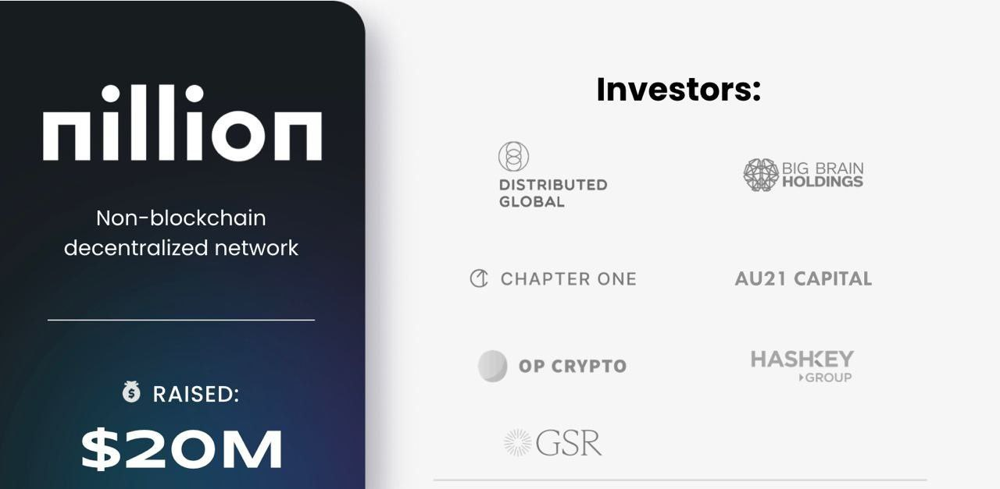

<h2 align=center> Nillion Verifier Node Guide </h2>

<p align="center">

</p>


- You can use either VPS or Ubuntu on Windows
- Make sure that you have a nillion address, if u have not, you can install [Keplr](https://chromewebstore.google.com/detail/keplr/dmkamcknogkgcdfhhbddcghachkejeap) and create a nillion address
- Now visit this [website](https://chains.keplr.app) and search `nillion` and add nillion testnet to your keplr wallet
- Open your Keplr wallet, search for `nillion` , u will get your nillion address
- Now request nillion faucet from [here](https://faucet.testnet.nillion.com/)


## 1/ Use this command to install docker on your system
```bash
sudo apt update -y && sudo apt install -y apt-transport-https ca-certificates curl software-properties-common && sudo curl -fsSL https://download.docker.com/linux/ubuntu/gpg | sudo gpg --dearmor -o /usr/share/keyrings/docker-archive-keyring.gpg && echo "deb [arch=$(dpkg --print-architecture) signed-by=/usr/share/keyrings/docker-archive-keyring.gpg] https://download.docker.com/linux/ubuntu $(lsb_release -cs) stable" | sudo tee /etc/apt/sources.list.d/docker.list > /dev/null && sudo apt update -y && apt-cache policy docker-ce && sudo apt install -y docker-ce && sudo usermod -aG docker ${USER} && su - ${USER} -c "groups" && docker --version
```
## 2/ Use this command to pull nillion accuser image
```bash
docker pull nillion/retailtoken-accuser:v1.0.0
```
## 3/ Use the below command to create a directory and to initialise the accuser
```bash
mkdir -p nillion/accuser && docker run -v ./nillion/accuser:/var/tmp nillion/retailtoken-accuser:v1.0.0 initialise
```
- After executing the above command, you will see `accound_id` and `public_key` in your terminal, copy the value

## 4/ Now run this command to get your accuser wallet private key & Import in Keplr Wallet
```bash
cat ~/nillion/accuser/credentials.json
```
- Copy the private key and save it NotePad , if you lose, you will not regain access to your accuser wallet

## 5/ Claim Faucet: https://faucet.testnet.nillion.com
- Submit Your Nillion Address & Claim

## 6/ Now visit [this site](https://verifier.nillion.com/verifier)

- Connect Keplr Wallet Import From Node Private Key
- Submit your `accound_id` and `public_key` in the appropriate field


<h2 align=center>NOW TAKE A BREAK FOR 60 MINS</h2>

---
## 7/ After 60 mins, run this final command for Run Node
```bash
docker run -v ./nillion/accuser:/var/tmp nillion/retailtoken-accuser:v1.0.0 accuse --rpc-endpoint "https://testnet-nillion-rpc.lavenderfive.com" --block-start 5107613
```

# ▄︻デ𝙂𝙚𝙩 𝙇𝙖𝙩𝙚𝙨𝙩 𝘼𝙞𝙧𝙙𝙧𝙤𝙥𝙨 & 𝙐𝙥𝙙𝙖𝙩𝙚𝙨═━一

### ▄︻デ𝙅𝙤𝙞𝙣 𝙏𝙚𝙡𝙚𝙜𝙧𝙖𝙢═━一 [🎀  𝐻𝒾𝒹𝒹𝑒𝓃 𝒢𝑒𝓂  🎀](https://t.me/hiddengemnews) 

### ░▒▓█►─═  𝓗𝓲𝒹ᗪ𝓔η Ǥέ𝕄 ═─◄█▓▒░
